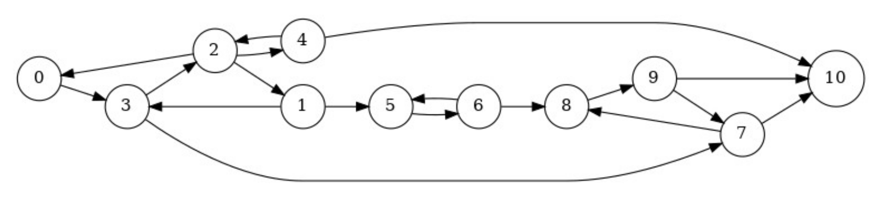

# DM sur les graphes
## Pile et File
Structure de Pile et de File d'entiers classique
## TasMin
Strucutre de Tas Minimal de sommets d'un graphe
## Graph
Algorithmes de BFS, DFS, Djikstra et Kozaraju, mis en exemples sur le graphe :

